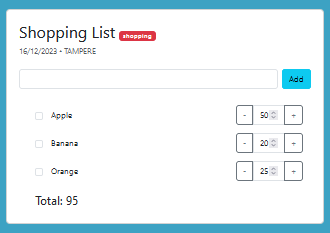

# Final Project - The Shopping List App

## Motivation
Welcome to the Web Software Production (5G00DM04-3006) final project! We are excited to delve into the development of a Shopping List App using JavaScript. This project encompasses both frontend and backend implementation, offering a valuable opportunity to apply theoretical knowledge to real-world scenarios.

Throughout this project, our goal is to strengthen our proficiency in JavaScript, explore the intricacies of web application architecture, and gain a comprehensive understanding of software production.

This project unfolds in five distinct phases, each serving as a stepping stone towards the successful completion of our Shopping List App. The phased approach encourages structured development, allowing us to gradually build, refine, and optimize our solution. Embracing this challenge will not only foster teamwork but also provide a sense of accomplishment at every milestone reached.

Expect to engage in careful planning and design during the initial phases, defining features, user interactions, and the overall architecture of the app. As we progress, we'll bring our design to life by implementing the frontend using JavaScript and developing a robust backend to handle data and ensure seamless functionality. The final phase involves rigorous testing to identify and rectify any issues, optimizing both frontend and backend for performance and user experience.

This course is not just about building a Shopping List App; it's about the journey of learning, collaboration, and innovation. Let's embrace the challenges, celebrate the victories, and make the most of this enriching experience.

## Project Deatils

**Server adress**                            172.16.4.167 (23wsp-pro11)

**Team members**                             Gopinath Hariharasudhan, Tim Hauber, Bryan Hartmann

**Completed Phases**                        1️⃣ ✅ 
                                            2️⃣ ✅
                                            3️⃣ ✅
                                            4️⃣ ✅
                                            5️⃣

**Codestyle**                               
- Everything is named with the camel case 
- We only use tabs instead of spaces
- There must be a ";" at the end of the line
- Everything is separated with a space

**How to start up the application**

To carry out the following steps, you should be familiar with the terminal and npm (Node Package Manager) and have Docker installed on the local computer

*Start the Application Locally:*

1. Navigate to the project directory in the terminal.
 - Use the "ls" command to list the contents of the directory.
 - Use "cd" and "cd .." command to navigate to either the backend or frontend folder.
3. In the frontend folder, use the command "npm run start" to initiate the frontend.
4. In the backend folder, use the command "npm run dev" to start the backend.
5. To stop the application, navigate to the respective frontend and backend folders and use "Ctrl+C" to terminate the processes.

*Start the Application with Docker:*

1. Ensure Docker Desktop is running.
2. Navigate to the project directory in the terminal.
3. Use the command "docker-compose up -d" to start the application using Docker.
4. To stop the application, use the command "docker-compose down".

**Using the Shoppinglist**

Before the shopping list can be used, one of the two ways to start the application must be completed

**Frontend -> 172.16.4.167:8000**

By calling the linked IP address, you will finally get to the shopping list. 

As an example, 3 purchases are already saved.

*Add* -> To add a purchase, enter the name of the desired item in the bar and add it by clicking on the Add button.

*Quantity* -> Each item is initially added with a quantity of 1 and can then be increased or decreased using the "+" or "-" button.

*Remove* -> To mark an item as no longer required or completed, simply click on the button to the left of the name and it will disappear from the list.

**Backend  -> 172.16.4.167:4000**

By calling the linked IP address, you get to the backend of the shopping list. This is not interesting for the end user, here you can only see the 3 examples and the updates when you remove, add or change something.

## Expected project grade 
Our Group TeamGBT is aiming for a 5.

We have shown impressive creative energy, leading to innovative solutions and fresh perspectives. This gives our project a uniqueness that sets it apart from others.The detailed description of our project forms the foundation for transparent development. We accompanied the entire development cycle with comprehensive documentation, starting with clear objectives, requirements, and a well-defined project outcome. This documentation enables not only us but also other stakeholders to track progress clearly. Our project's coding is also characterised by a clear structure, meaningful variable names, and commented code blocks, which enhances its clarity. These decisions make it easier for the team to work together and increase the maintainability and scalability of the code.Strict compliance with all requirements is crucial for success. Our team not only fulfilled all requirements but also went beyond the security and functionality aspects. Coding standards and best practices were followed at every stage of development.As a team, we are proud to have achieved an outstanding score of 5 points, reflecting our collective effort, excellent performance, and high-quality project.

